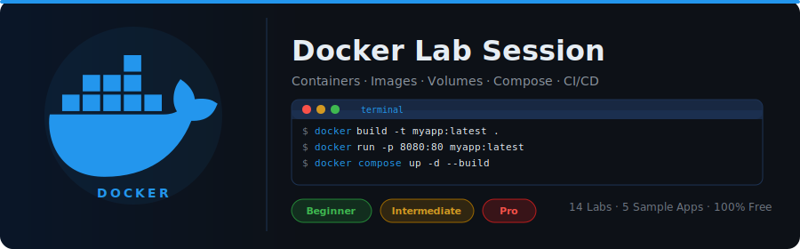
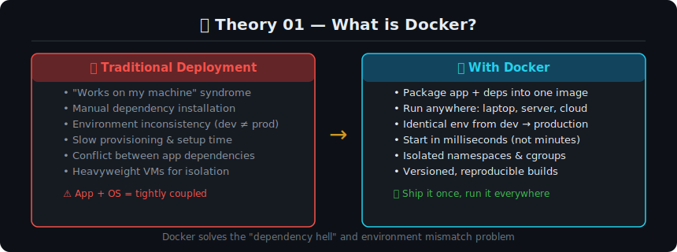
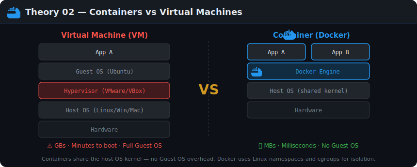
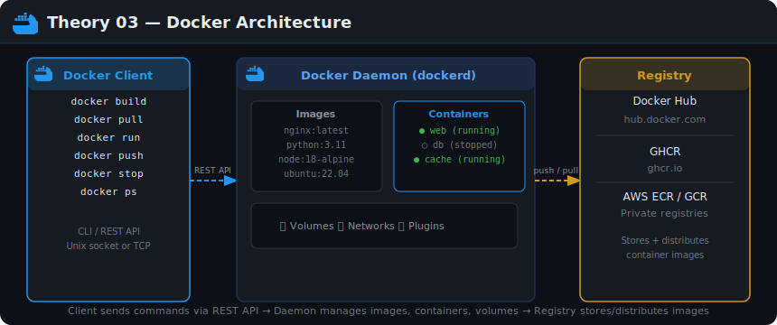
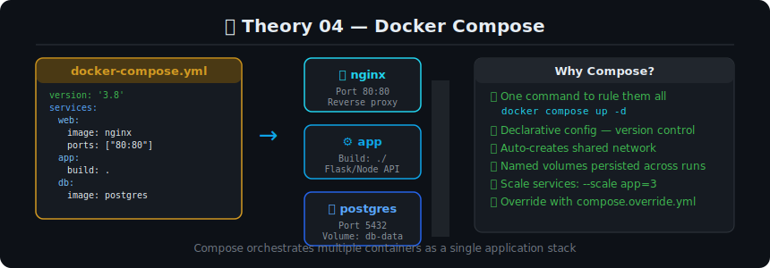
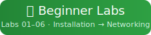
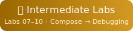
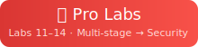

<div align="center">
  
</div>

<div align="center">


</div>

---

## 📖 Theory — Before You Start

Work through these concepts in order before touching the labs. Each section builds on the previous one.

---

### Theory 01 — What is Docker?



**The Core Problem Docker Solves**

Before Docker, deploying software meant spending hours on every server doing the same setup: install the right Python version, install the right libraries, configure environment variables, deal with OS differences, and pray nothing conflicts with another app already running. This is called **dependency hell**.

Docker packages your application and **all its dependencies into a single portable unit** called a **container image**. You build it once on your laptop, and it runs identically everywhere — your colleague's Mac, a Linux CI server, and a production cloud VM.

> 💡 **Mental model:** Think of a container like a shipping container. Before standardized shipping containers, every cargo ship loaded and unloaded items individually. Containers standardized the process. Docker does the same for software.

**Key terms:**
- **Image** — the blueprint (read-only). Like a class in OOP.
- **Container** — a running instance of an image. Like an object instantiated from a class.
- **Dockerfile** — the recipe to build an image.
- **Registry** — a store for images (Docker Hub, GHCR, ECR).

---

### Theory 02 — Containers vs Virtual Machines



**Why not just use VMs?**

Virtual Machines solve the isolation problem by emulating an entire computer inside your computer. But they're heavy:
- Each VM needs its own full Guest OS (Ubuntu inside Windows, for example)
- A VM typically uses **1-5 GB of RAM** just for the OS overhead
- They take **minutes** to boot because the OS must fully start

**Containers are different** — they share the host machine's OS kernel. Instead of emulating hardware and booting an OS, Docker uses Linux kernel features:
- **Namespaces** — isolate process IDs, network, filesystem, and users per container
- **cgroups** — limit CPU, memory, and I/O per container

| | Container | VM |
|--|-----------|-----|
| Startup time | Milliseconds | Minutes |
| Size | MBs | GBs |
| Isolation | Process-level | Hardware-level |
| OS overhead | None (shared) | Full Guest OS |
| Portability | Any Docker host | Hypervisor-specific |

> 💡 **When would you still use a VM?** When you need different kernel versions, Windows containers on Linux, or stronger security isolation (e.g., running untrusted code).

---

### Theory 03 — Docker Architecture



Docker is a **client-server system**:

**1. Docker CLI** — the tool you type commands into (`docker run`, `docker build`). It's just a client that sends HTTP requests.

**2. Docker Daemon (`dockerd`)** — the background server process. It receives API calls from the CLI and does the actual work:
- Builds images from Dockerfiles
- Creates and manages containers
- Manages networks and volumes
- Communicates with registries

**3. Container Registry** — a repository for storing and distributing images. Docker Hub is the default public registry. You can also use:
- **GHCR** (GitHub Container Registry) — free for public repos, integrated with GitHub Actions
- **AWS ECR / Azure ACR / GCP Artifact Registry** — cloud-provider managed registries
- **Self-hosted** — Harbor, Nexus

**The flow:**
```
You type:  docker run nginx
    ↓
CLI sends REST API request to daemon
    ↓
Daemon checks: do I have nginx image locally?
    ↓ (no)
Daemon pulls nginx:latest from Docker Hub
    ↓
Daemon creates a container from the image
    ↓
Container starts, nginx serves on port 80
```

---

### Theory 04 — Docker Compose



**Why Compose?**

Most real applications aren't just one container. A typical web app has:
- **Web server** (Nginx) — serves static files, proxies to backend
- **Backend API** (Flask/Node) — business logic
- **Database** (PostgreSQL) — persistent data
- **Cache** (Redis) — session data, rate limiting

You *could* run each with individual `docker run` commands, but:
- You'd need to create networks manually
- You'd need to remember all the `-e` environment flags
- Starting/stopping requires 4 separate commands
- No version control of your configuration

**Compose solves this** with a single `docker-compose.yml` file:
- Declarative: describe the desired state, not the steps
- Version-controlled: commit the file alongside your code
- One command: `docker compose up -d` starts everything
- Auto-networking: all services share a network and resolve each other by service name

**Core concepts in Compose:**
- `services` — the containers to run
- `volumes` — named persistent storage
- `networks` — (optional) custom networks; Compose auto-creates one
- `depends_on` — controls startup order (use with `condition: service_healthy`)
- `env_file` — load environment variables from a `.env` file

---

## 🚀 Quick Start

```bash
# 1. Clone the repo
git clone https://github.com/SenukDias/docker-lab.git
cd docker-lab

# 2. Verify Docker is installed
docker --version
docker compose version

# 3. Run the quickstart sample
cd samples/python-flask
docker build -t flask-lab:v1 .
docker run -d -p 5000:5000 --name flask flask-lab:v1
curl http://localhost:5000
```

---

## 🗺️ Lab Navigation

<div align="center">

| | | |
|:---:|:---:|:---:|
| <a href="beginner/README.md"></a> | <a href="intermediate/README.md"></a> | <a href="pro/README.md"></a> |

</div>

---

## 📁 Repository Structure

```
docker-lab/
├── assets/               ← Diagrams, banner, navigation buttons
├── beginner/             ← Labs 01–06 (Installation → Networking)
├── intermediate/         ← Labs 07–10 (Compose → Debugging)
├── pro/                  ← Labs 11–14 (Multi-stage → Security)
├── samples/
│   ├── python-flask/     ← Production Flask app + Dockerfile
│   ├── nodejs-express/   ← Node.js multi-stage Dockerfile
│   ├── nginx-static/     ← Nginx static site
│   ├── fullstack/        ← Nginx + Flask + PostgreSQL + Redis
│   └── multistage/       ← Multi-stage build comparison
├── tasks/                ← Challenges for each level
└── .github/workflows/    ← CI lab validator
```

---

## 📚 All Labs

### 🟢 Beginner Track

| Lab | Topic | Key Skills |
|-----|-------|-----------|
| [01 — Installation](beginner/lab-01-installation.md) | Docker Desktop / Engine | All OS install, verify |
| [02 — First Container](beginner/lab-02-first-container.md) | Run, stop, exec, logs | Lifecycle commands |
| [03 — Dockerfile](beginner/lab-03-dockerfile.md) | Build custom images | FROM, RUN, CMD, COPY |
| [04 — Images](beginner/lab-04-images.md) | Layers & optimization | Cache, tags, history |
| [05 — Volumes](beginner/lab-05-volumes.md) | Persistent storage | Named volumes, bind mounts |
| [06 — Networking](beginner/lab-06-networking.md) | Container communication | Bridge, custom networks, DNS |

### 🟡 Intermediate Track

| Lab | Topic | Key Skills |
|-----|-------|-----------|
| [07 — Docker Compose](intermediate/lab-07-docker-compose.md) | Multi-service apps | YAML config, compose up/down |
| [08 — Multi-Container](intermediate/lab-08-multi-container.md) | Full app stack | Nginx + Flask + Redis + PostgreSQL |
| [09 — Environment](intermediate/lab-09-environment.md) | Config & secrets | .env, overrides, Docker secrets |
| [10 — Debugging](intermediate/lab-10-debugging.md) | Diagnose issues | logs, exec, inspect, stats |

### 🔴 Pro Track

| Lab | Topic | Key Skills |
|-----|-------|-----------|
| [11 — Multi-stage Builds](pro/lab-11-multistage-builds.md) | Optimize images | Builder pattern, scratch |
| [12 — Docker Hub](pro/lab-12-docker-hub.md) | Image registries | Push, pull, GHCR, ECR |
| [13 — CI/CD](pro/lab-13-cicd-docker.md) | GitHub Actions | Build, scan, push pipeline |
| [14 — Security](pro/lab-14-security.md) | Production hardening | Non-root, read-only, CVE scanning |

---

## 🧪 Sample Applications

| Sample | Stack | Complexity |
|--------|-------|-----------|
| [python-flask](samples/python-flask/) | Python 3.11 + Gunicorn | 🟢 Beginner |
| [nodejs-express](samples/nodejs-express/) | Node.js 20 + Alpine | 🟢 Beginner |
| [nginx-static](samples/nginx-static/) | Nginx + custom HTML | 🟢 Beginner |
| [fullstack](samples/fullstack/) | Nginx + Flask + PostgreSQL + Redis | 🟡 Intermediate |
| [multistage](samples/multistage/) | Python multi-stage comparison | 🔴 Pro |

---

<details>
<summary>📋 Docker Cheat Sheet — Essential Commands</summary>

```bash
# ── Images ─────────────────────────────────────────────────────
docker pull nginx:alpine           # pull from registry
docker images                      # list local images
docker build -t myapp:v1 .        # build from Dockerfile
docker tag myapp:v1 myapp:latest  # add tag
docker rmi myapp:v1                # remove image
docker image prune -a              # remove all unused images

# ── Containers ─────────────────────────────────────────────────
docker run -d -p 8080:80 --name web nginx   # run detached
docker ps                          # list running containers
docker ps -a                       # all containers
docker logs -f web                 # follow logs
docker exec -it web bash           # interactive shell
docker stop web && docker rm web   # stop + remove
docker container prune             # remove all stopped

# ── Volumes ────────────────────────────────────────────────────
docker volume create mydata        # create named volume
docker volume ls                   # list volumes
docker run -v mydata:/data nginx   # use volume
docker run -v $(pwd):/app nginx    # bind mount

# ── Networking ─────────────────────────────────────────────────
docker network create mynet        # custom network
docker run --network mynet nginx   # join network
docker network inspect mynet       # inspect
docker network prune               # remove unused

# ── Compose ────────────────────────────────────────────────────
docker compose up -d               # start all services
docker compose ps                  # service status
docker compose logs -f app         # follow service logs
docker compose exec app bash       # shell in service
docker compose down                # stop + remove containers
docker compose down -v             # also remove volumes

# ── System ─────────────────────────────────────────────────────
docker system df                   # disk usage
docker system prune -a             # clean everything unused
docker stats                       # live resource usage
```

</details>

---

<div align="center">
  <sub>🐳 Docker Lab Session · Built for hands-on learners · <a href="https://github.com/SenukDias">@SenukDias</a></sub>
</div>
